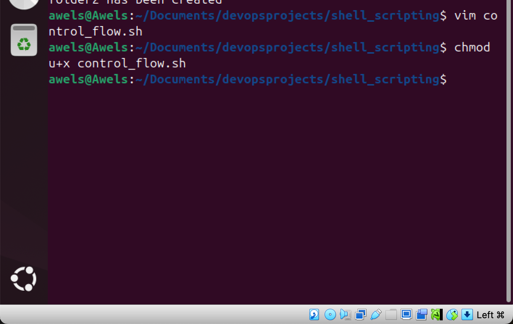
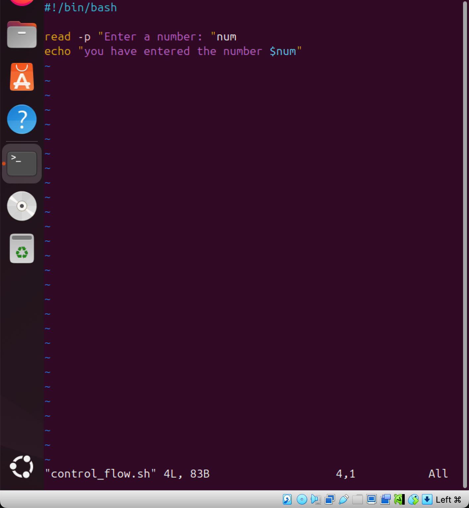
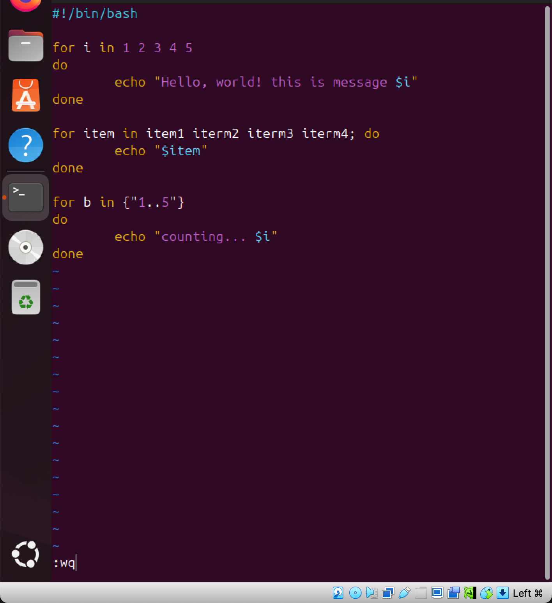

# LinuxShellScripting_ControlFlows
Here I would be submitting my project on linux shell scripting (cash flow) 

Control flow statements are backbone of makinging decision in programming. 

# First Task
create a file and name it "control_flow.sh

the image below shows that the file has been successfully created using vim and once that has been created, vim opened the file and the picture below depicts that 

# the if-else statement in bash

this uses the  users imput to make decissions. 

the image below depicts this 

the next step is to execute the file after saving the file. the image below shows that the file has been saved. 

after saving the file, the next thing is to grant the user the permission to approve and this is done by running this command 'chmod u+x' and the name of the file. the image below depicts this. 

from the image above, it shows that i have given the user the permission to execute the file and i can go ahead to execute the file and i wont receive a permission denied rather i would recieve a successful execution. 

to execute the script, it is done by using this command './control_flow.sh'

the image below depicts that 

once i clicked enter to execute the file, it returned back asking for me to impute a number as expected and the image below depicts it

the image below shows that i have imputed a number 

the next task to do is to update the code adding the echo feauture and the image below depicts this 

the reason for adding the echo feauture is to return back to the screen the value attached to the $num variable. 

the next thing to do is to save the file and the image below depicts that 

theimage below shows that the file has been saved and the next thing to do is to execute the file 
however, the image below shows that the file has been saved 

the next thing to do is to execute the file and this is done by running this command. 
'./control_flow.sh and the image below depcts this

I tried executing the script, however this was not successful due to some mistakes on my script. i was able to enter back into my script and make the neccessary corrections and the image below depicts that

now i am going to save the file and then execute the file 

the image above shows that the script was succesful and it also echoed "you have entered a number" as requested in the script once it is successful. 

# The IF Statement 
the if statement allows ypu to execute a command based on a condition. the 'if' starts the conditional statement. the [] contains the condition and it must be closed to prove that the condition has been concluded. 'then' simply means that if the condition is true then execute the command that follows this keyboard. while the 'fi' ends the statement. 

the image below depicts this 

this is an image thst showws the if statement in the script. it is time to execute the script. 

the image below shows that the file has been successfully saved. 

the next thing to do is to execute the script and this is done by using the command below in the image. 

i tried executing the script but due to some typographical error the script was not completely successful. however i have been able to correct the script and the image below depicts this. 

the next thing to do is to execute the script. the image below shows that the script was completely executed and was successful. 

# The ELIF Statement
this is the else if statement that allows you to test additional if the previous 'if' conditions were not met. 
the image below depicts the elif statement 

after saving the file the next thing to do is to execute the file and this is done by using the command below in the image 

i changed the number twice so that we can have both result and the image below depicts this. 

# LOOP
loop allows automate and repeat tasks without writing the same code over and over again. it helps in batch processing, data analysis, automatated testing etc. there are three primary types of loops and they are 
1. for 
2. while
3. until

# FOR
to be able to practice this, i would first create a new script.

this is done by using vim and the name of the file that i intend to create. the image below depicts this. 

after creating the file the next thing to do is to write the code. the image below depicts that

after writing the code the next thing to do is to save the file.

the next thing to do is to give the user the right to execute the file and this is done by using this command 'chmod u+x' and the name of the file. the image below depicts that. 
 

now that i have given the user the permission to execute the file, i am going to execute the file and the image below depicts that. 

after executing the file, this is the result in the image below

i am going to edit the script one more time to get another result and the image below depicts this 

the next thing is to save the file and the image below depicts it

afer which i would execute the file and this is the result below 

# C-STYLE FORM
this is another form of loop. however it is a special way to repeat a task multiple times. 
the first step is to create a file using vim. The image below depicts this. 

the next thing is to run the code on the script. the image below depicts that.

then the next thing to do is to save the file and the image below depicts that.

the next thing to do is to give the user the permission to execute the script. this is done by using this code 'chmod u+x' amd the name of the file. the script below depicts that. 

now that i have given the user the permission to execute the file, the next thing to do is to excute the file using the command below.

the image below is the result of running the script.

# CONCLUSION 
Here i have successfully finished this task. i have been able to run the control flow and everything was succesful. the if, the elif, the loop etc. the single line loop, the multiple line loop, the c style. control flows are the back bone for making decisions in programming and it helps to reduce repetition and makes the work go faster and easier. 